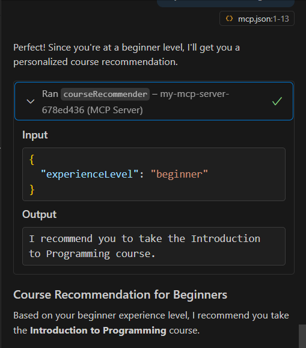
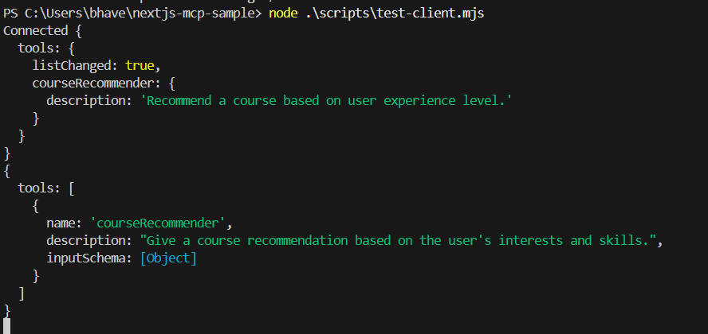

# NextJS MCP Sample

A Next.js web application that provides programming course recommendations using the Model Context Protocol (MCP). This project features a course recommendation system that suggests appropriate courses based on user experience levels.

## Features

- 🎓 **Course Recommendation System**: Get personalized course suggestions based on your programming experience level
- 🌐 **MCP Integration**: Uses Model Context Protocol for intelligent recommendations
- ⚡ **Next.js 15**: Built with the latest Next.js framework

## What It Does

This application helps users find the right programming courses by:

- Asking about their current experience level (beginner, intermediate, advanced)
- Providing targeted course recommendations
- Offering a clean interface to explore programming education options

## Tech Stack

- **Framework**: Next.js 15
- **Language**: TypeScript
- **Styling**: Tailwind CSS
- **MCP Integration**: @vercel/mcp-adapter, @modelcontextprotocol/sdk
- **Database**: Redis (optional)
- **Validation**: Zod

## Getting Started

### Prerequisites

- Node.js 18+ installed
- npm, yarn, pnpm, or bun

### Installation

1. Clone the repository:

```bash
git clone https://github.com/Bhavesh0577/nextjs-mcp-sample.git
cd nextjs-mcp-sample
```

2. Install dependencies:

```bash
npm install
```

3. Run the development server:

```bash
npm run dev
```

4. Open [http://localhost:3000](http://localhost:3000) to view the application.

## Project Structure

```
├── src/
│   └── app/
│       ├── page.tsx          # Main homepage
│       ├── layout.tsx        # App layout
│       └── [transport]/
│           └── route.ts      # MCP API endpoints
├── public/                   # Static assets
├── scripts/
│   └── test-client.mjs      # Test client for MCP
└── output/                  # Application screenshots
```

## MCP Configuration

The project includes MCP server configuration in `mcp.json`:

- GitHub integration for enhanced AI capabilities
- Custom course recommendation server deployed on Vercel

## API Endpoints

- **POST/GET `/mcp`**: Course recommendation API using MCP protocol
- **Tool**: `courseRecommender` - Returns course suggestions based on experience level

## Available Scripts

- `npm run dev` - Start development server
- `npm run build` - Build for production
- `npm run start` - Start production server
- `npm run lint` - Run ESLint

## Course Recommendations

The system provides:

- **Beginners**: Introduction to Programming course
- **Intermediate/Advanced**: Advanced Algorithms and Data Structures course

## Screenshots

### Application Interface



### Test Results



## Contributing

1. Fork the repository
2. Create a feature branch
3. Make your changes
4. Submit a pull request

## License

This project is open source and available under the [MIT License](LICENSE).
